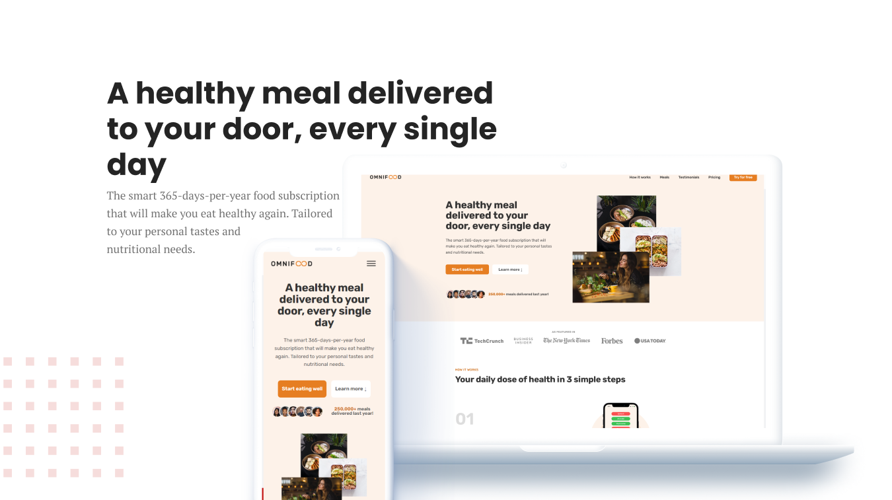

# Omnifood

live version [here]!

## About the Project
A one-page landing site of Omnifood brand. The goal is to create website for food delivery service.
Omnifood is a premium food delivery service with the mission to bring affordable and healthy meals. 
This is built and taught from a Udemy [course] made by Jonas schmedtmann.

  

[course]: https://www.udemy.com/course/design-and-develop-a-killer-website-with-html5-and-css3/
[here]: https://dominikalesniewska.github.io/omnifood-website/
